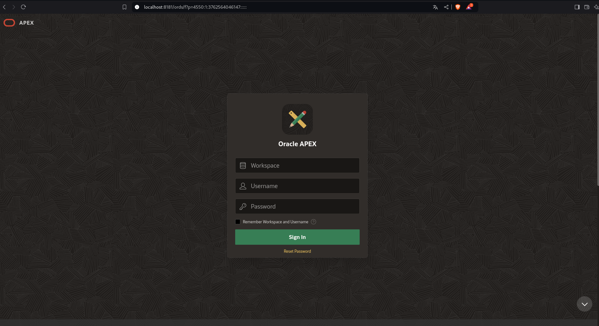

## ORACLE DATABASE + ORDS + APEX

Project APEX installation comand.

```shell
docker compose up
```


### EM

```shell
https://localhost:8500/em
```

```shell
USER:       system
PASSWORD:   Oracle123
```


### APEX

```shell
http://localhost:8181/ords
```

```shell
WORKSPACE:      internal
USER:           ADMIN
PASSWORD:       Welcome_1
```




### SQLDEVELOPER


```shell
USER:               system
PASSWORD:           Oracle123
PORT:               8521
SERVICE NAME:       xepdb1
```


### YOUTUBE

[](https://www.youtube.com/watch?v=VaumYDXX7L0)
